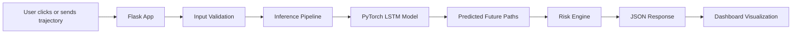
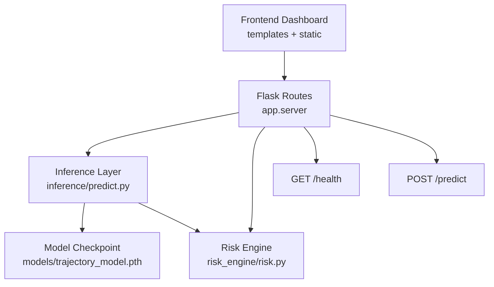
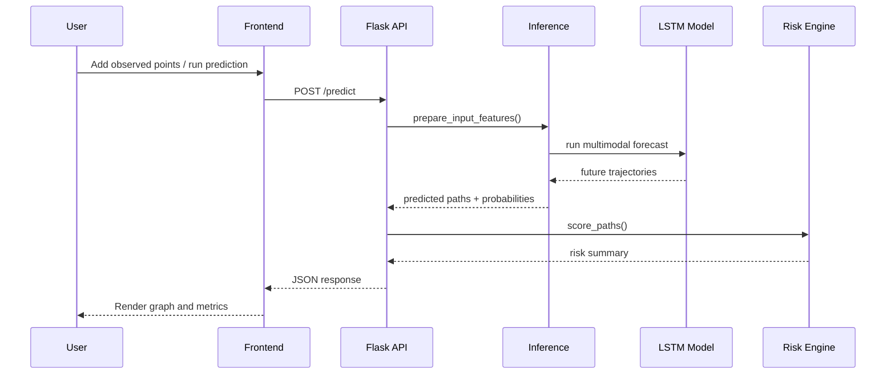
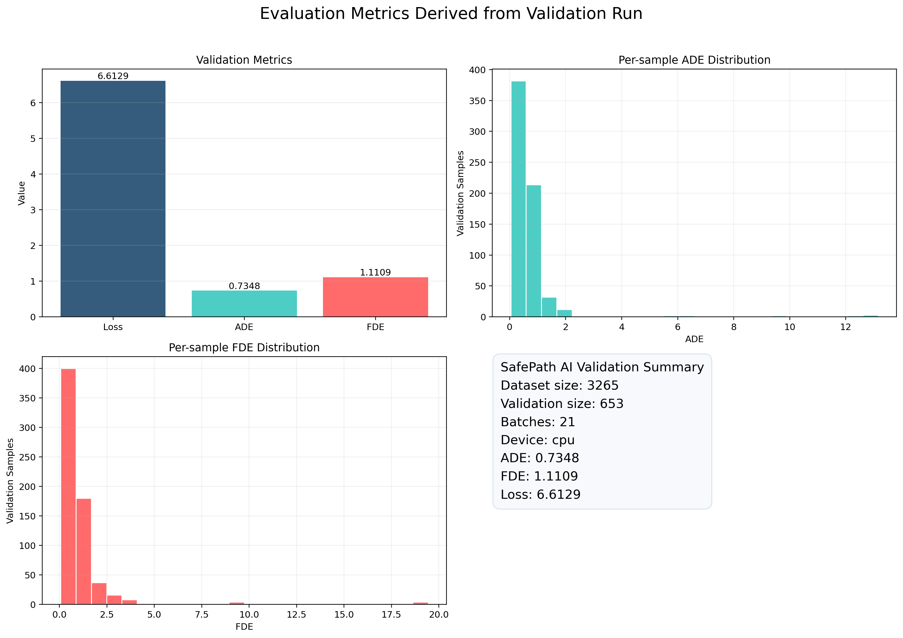
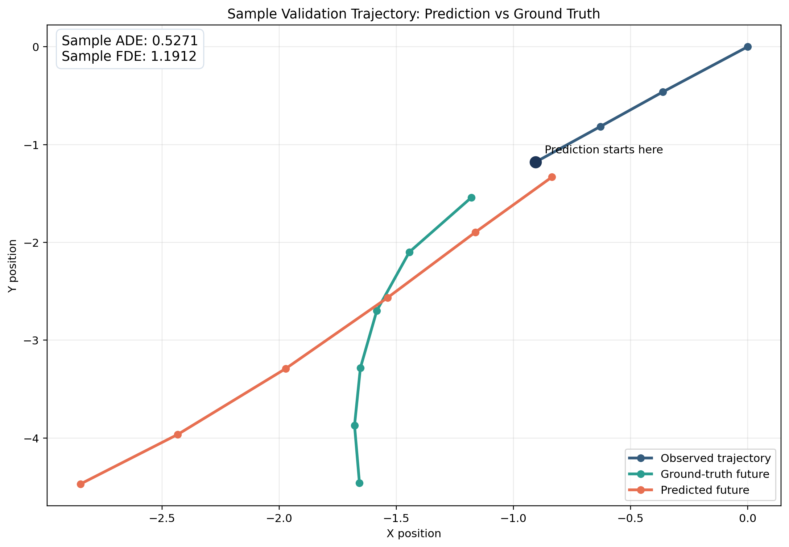

# SafePath AI

SafePath AI is a real-time pedestrian trajectory prediction and collision risk analysis system designed for autonomous driving environments.

It uses 2 seconds of past motion data to predict 3 possible future trajectories for the next 3 seconds using an LSTM-based deep learning model trained on the nuScenes dataset. The system also estimates collision probability, minimum distance, and time-to-collision (TTC), then visualizes the results in an interactive web dashboard.

## Demo Video

Demo video: https://youtu.be/yAJtvBthkjw

## Team

- Pranav V
- Shariq Sheikh

## GitHub Repository

Repository: https://github.com/pranavv1210/safepath-ai.git

## 1. Project Overview

### Problem Statement

Autonomous vehicles must not only detect pedestrians and cyclists, but also predict where they are likely to move in the next few seconds. SafePath AI addresses this challenge by forecasting multiple future paths and analyzing possible collision risk in real time.

### What the Project Does

- Observes past pedestrian motion
- Predicts multiple possible future trajectories
- Estimates collision probability and TTC
- Simulates real-time prediction at 2 Hz
- Displays outputs in an interactive dashboard

### Key Features

- LSTM-based temporal trajectory modeling
- Multi-modal prediction with 3 future paths
- Collision risk scoring with TTC
- ADE and FDE evaluation metrics
- Flask-based interactive dashboard
- Cloud deployment support through Render

## 2. Model Architecture

### High-Level System Flow



### Architecture Components



### Request Flow



### Runtime Configuration

- Observed steps: `4`
- Future steps: `6`
- Sampling rate: `2 Hz`
- Input format: `[x, y, vx, vy]`
- Model type: `LSTM encoder-decoder`
- Hidden size: `64`
- Dropout: `0.1`

### Project Structure

```text
safepath-ai/
|-- app/
|   |-- checkpoints/
|   `-- server.py
|-- data/
|   `-- processed/
|-- inference/
|   `-- predict.py
|-- models/
|   |-- trajectory_model.py
|   `-- trajectory_model.pth
|-- preprocessing/
|-- risk_engine/
|   `-- risk.py
|-- static/
|   |-- css/
|   `-- js/
|-- templates/
|   `-- index.html
|-- training/
|-- utils/
|-- visualization/
|-- app.py
|-- requirements.txt
`-- README.md
```

## 3. Dataset Used

### Dataset

The project uses the public **nuScenes** autonomous driving dataset for pedestrian and cyclist trajectory prediction.

### Data Representation

- Input trajectory window: 4 observed steps
- Prediction horizon: 6 future steps
- Features used: `x`, `y`, `vx`, `vy`
- Processed dataset file: `data/processed/nuscenes_native_sequences.pt`

### Preprocessing Summary

- Raw trajectories are cleaned and validated
- Motion sequences are structured into fixed time windows
- Position and velocity are used as input features
- Coordinates are converted to relative form before inference

## 4. Setup & Installation Instructions

### Requirements

- Python 3.11
- pip

### Install Dependencies

```bash
pip install -r requirements.txt
```

## 5. How to Run the Code

### Run the Web App

```bash
python app.py
```

Open:

- http://127.0.0.1:5000

### Deployment

Build command:

```bash
pip install -r requirements.txt
```

Start command:

```bash
gunicorn app.server:app
```

### API Endpoints

#### `GET /`

Loads the dashboard UI.

#### `GET /health`

```json
{
  "status": "ok",
  "model_ready": true
}
```

#### `POST /predict`

Request:

```json
{
  "trajectory": [[x, y, vx, vy], ...]
}
```

Response:

```json
{
  "paths": [...],
  "probabilities": [...],
  "risk": [...],
  "meta": {
    "ade": 0.7348,
    "fde": 1.1109,
    "latency_ms": 0.0
  }
}
```

## 6. Example Outputs / Results

### Dashboard Output

The dashboard displays:

- Past trajectory
- Predicted future trajectories
- Collision probability
- Minimum distance
- Time-to-collision
- ADE, FDE, and latency

### Validation Metrics

Evaluation was run on the saved checkpoint `models/trajectory_model.pth` using the processed validation split.

- Dataset size: `3265`
- Validation size: `653`
- Validation batches: `21`
- Loss: `6.6129`
- ADE: `0.7348`
- FDE: `1.1109`

### Evaluation Metrics Visualization



### Sample Trajectory Prediction



## Notes

- The repository is intended to be publicly accessible during evaluation.
- The dataset is not required at runtime after the trained checkpoint is available.
- The deployed system uses Flask, Gunicorn, and Render.
