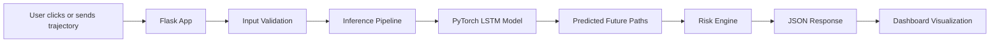
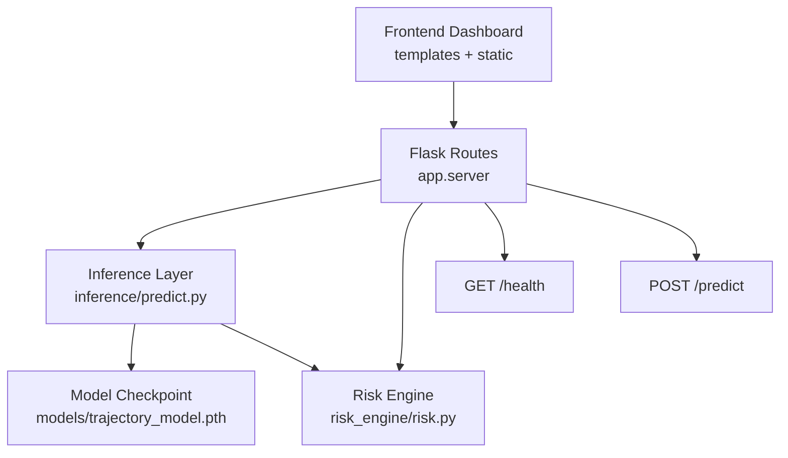
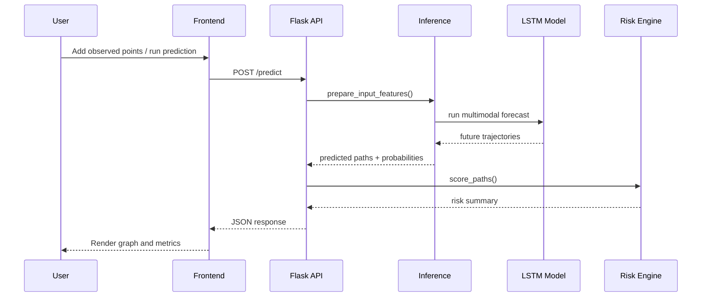
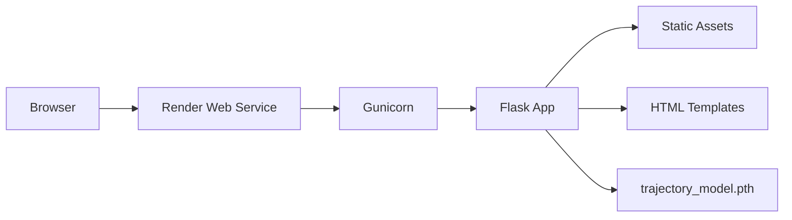

# 🚗 SafePath AI

SafePath AI is a real-time pedestrian trajectory prediction and risk analysis system designed for autonomous driving environments.

It takes **2 seconds of past motion data (x, y coordinates)** and predicts **3 possible future trajectories (next 3 seconds)** using an LSTM-based deep learning model trained on the nuScenes dataset.

The system also estimates **collision risk, probability, and time-to-collision (TTC)** and visualizes everything in an interactive web dashboard.

---

## 🎥 Demo

[](https://youtu.be/yAJtvBthkjw)

👉 Demo video: https://youtu.be/yAJtvBthkjw

---

## 👥 Team

* Pranav V
* Shariq Sheikh

---

## 🚀 What This Project Does

SafePath AI solves a key challenge in autonomous driving:

> "Predict where pedestrians and cyclists will move — not just where they are."

### The system:

* Observes past movement (trajectory)
* Predicts multiple possible future paths
* Estimates risk of collision
* Updates predictions continuously (real-time simulation)

---

## ⭐ Key Features

* 🧠 **LSTM-based Temporal Modeling** (sequence prediction)
* 🔮 **Multi-modal Predictions** (3 possible future paths)
* ⚠️ **Collision Risk Analysis** (probability + TTC)
* 📊 **ADE / FDE Metrics for evaluation**
* 🎯 **Real-time Simulation (2 Hz streaming)**
* 🖥️ **Interactive Dashboard Visualization**
* ☁️ **Cloud Deployment Ready (Render)**

---

## 🧠 How It Works (Simple Explanation)

1. User provides **past trajectory (4 points)**
2. Model processes motion patterns
3. Predicts **3 possible future paths (6 points each)**
4. Each path is analyzed for:

   * collision probability
   * minimum distance
   * time-to-collision
5. Results are displayed visually + numerically

---

## 🧩 System Overview



---

## 🏗️ Architecture

### High-Level Components



---

### 🔁 Request Flow



---

### ☁️ Deployment Architecture



---

## 📁 Project Structure

```text
safepath-ai/
|-- app/
|   `-- server.py
|-- inference/
|   `-- predict.py
|-- models/
|   |-- trajectory_model.py
|   `-- trajectory_model.pth
|-- risk_engine/
|   `-- risk.py
|-- static/
|   |-- css/
|   `-- js/
|-- templates/
|   `-- index.html
|-- training/
|-- preprocessing/
|-- utils/
|-- app.py
|-- Procfile
|-- runtime.txt
|-- requirements.txt
`-- README.md
```

---

## ⚙️ Runtime Pipeline

### 📥 1. Input Window

* Observed steps: `4` (2 seconds)
* Forecast steps: `6` (3 seconds)
* Sampling rate: `2 Hz`
* Input format: `[x, y, vx, vy]`

---

### 🤖 2. Inference (Model Prediction)

* Input trajectory is validated
* Converted to relative coordinates
* Passed through LSTM encoder-decoder
* Generates **3 possible future paths**
* Converted back to global coordinates

---

### ⚠️ 3. Risk Analysis

For each predicted path:

* Compute minimum distance from ego vehicle
* Estimate collision probability
* Calculate time-to-collision (TTC)
* Assign risk level:

  * 🟢 LOW
  * 🟡 MEDIUM
  * 🔴 HIGH

---

### 🖥️ 4. Visualization

Dashboard displays:

* Past trajectory (blue)
* Predicted paths (green/yellow/red)
* Coordinate values
* Risk analysis
* Model metrics (ADE, FDE, latency)

---

## 🧠 Core Modules

### 🔹 Backend

* `app/server.py` → Flask API and routes
* `app.py` → Local entry point

---

### 🔹 Inference

* `predict.py` → model inference pipeline
* `trajectory_model.py` → LSTM model

---

### 🔹 Risk Engine

* `risk.py` → collision scoring logic

---

### 🔹 Frontend

* `index.html` → UI layout
* `styles.css` → styling
* `app.js` → logic + visualization

---

## 🔌 API

### `GET /`

Loads dashboard UI.

---

### `GET /health`

```json
{
  "status": "ok",
  "model_ready": true
}
```

---

### `POST /predict`

#### Request:

```json
{
  "trajectory": [[x, y, vx, vy], ...]
}
```

---

#### Response:

```json
{
  "paths": [...],
  "probabilities": [...],
  "risk": [...],
  "meta": {
    "ade": 0.0,
    "fde": 0.0
  }
}
```

---

## 💻 Local Setup

```bash
pip install -r requirements.txt
python app.py
```

Open:

* http://127.0.0.1:5000

---

## ☁️ Deployment (Render)

### Build:

```bash
pip install -r requirements.txt
```

### Start:

```bash
gunicorn app.server:app
```

---

## ⚠️ Deployment Notes

* Dataset NOT required at runtime
* Only `.pth` model is needed
* Fully browser-based UI

---

## 🌍 Use Cases

* Autonomous driving systems
* Smart city safety
* Traffic monitoring
* Human behavior prediction

---

## 🚀 Future Improvements

* Add social interaction modeling
* Improve multi-modal diversity
* Enhance real-time streaming
* Add live sensor integration

---

## 📌 Repository

https://github.com/pranavv1210/safepath-ai.git

---

## 📜 License

For academic and hackathon use.
