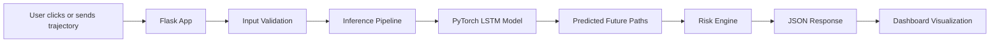
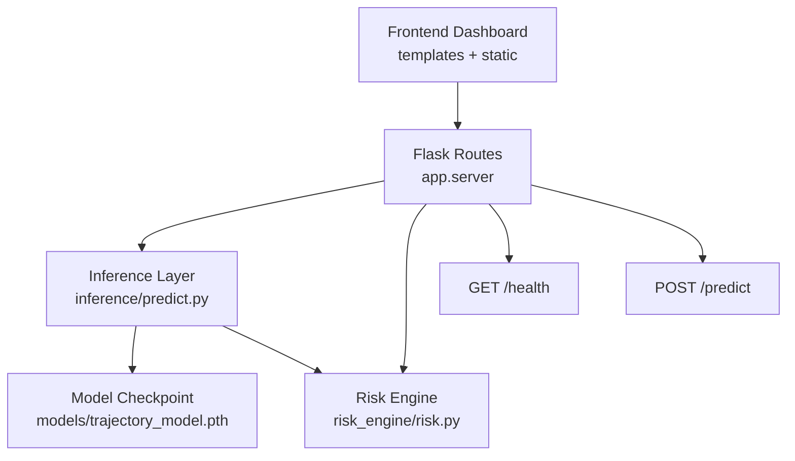
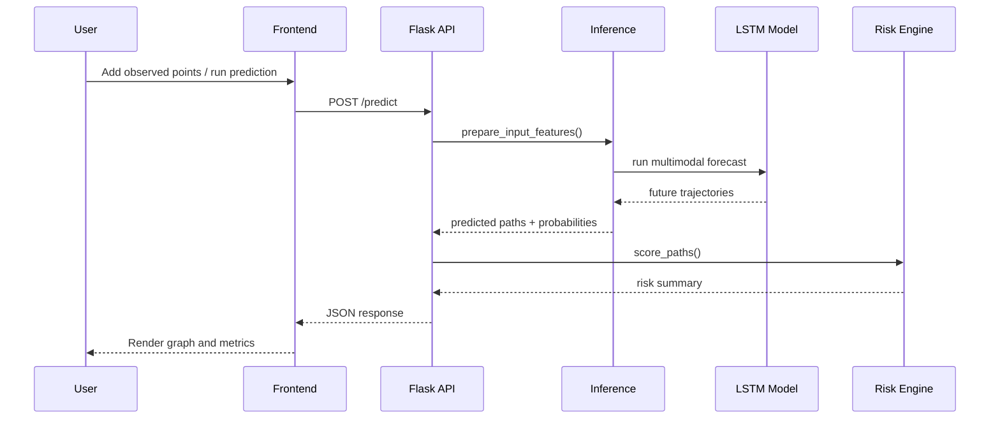
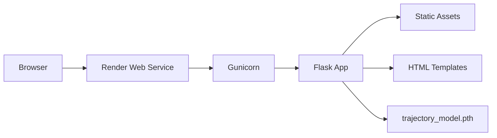

# SafePath AI

SafePath AI is a Flask + PyTorch project for pedestrian trajectory forecasting and collision-risk analysis. It takes the latest observed trajectory points, predicts multiple possible future paths with an LSTM model, scores risk for each path, and presents the result in a browser dashboard.

## Team

- Pranav V
- Shariq Sheikh

## Highlights

- Flask backend with HTML/CSS/JS dashboard
- PyTorch LSTM trajectory forecasting model
- Multi-modal future path generation
- Collision-risk scoring and time-to-collision estimation
- Interactive canvas visualization
- Render-ready deployment setup

## System Overview



## Architecture

### High-Level Components



### Request Flow



### Deployment Architecture



## Project Structure

```text
safepath-ai/
|-- app/
|   `-- server.py
|-- inference/
|   `-- predict.py
|-- models/
|   |-- trajectory_model.py
|   `-- trajectory_model.pth
|-- risk_engine/
|   `-- risk.py
|-- static/
|   |-- css/
|   `-- js/
|-- templates/
|   `-- index.html
|-- training/
|-- preprocessing/
|-- utils/
|-- app.py
|-- Procfile
|-- runtime.txt
|-- requirements.txt
`-- README.md
```

## Runtime Pipeline

### 1. Input Window

- Observed steps: `4`
- Forecast steps: `6`
- Sampling rate: `2 Hz`
- Feature format: `[x, y, vx, vy]`

### 2. Inference

- Input trajectory is validated
- Coordinates are shifted into the model’s expected relative frame
- The LSTM generates multiple candidate futures
- Predictions are restored to global display coordinates

### 3. Risk Analysis

- Each predicted path is compared against the assumed ego vehicle path
- Minimum distance and collision likelihood are computed
- Risk is classified as `LOW`, `MEDIUM`, or `HIGH`

### 4. Frontend Rendering

- Past observations are shown on the canvas
- Predicted paths are rendered in different colors
- The right panel shows risk, confidence, latency, ADE, and FDE

## Core Modules

### Backend

- `app/server.py`: Flask app factory, routes, health checks, prediction endpoint
- `app.py`: local run entrypoint

### Inference

- `inference/predict.py`: model loading, feature preparation, multimodal forecasting
- `models/trajectory_model.py`: LSTM encoder-decoder model definition

### Risk Engine

- `risk_engine/risk.py`: risk scoring and collision analysis

### Frontend

- `templates/index.html`: dashboard structure
- `static/css/styles.css`: styling and layout
- `static/js/app.js`: graph rendering, interactions, and API calls

## API

### `GET /`

Loads the dashboard UI.

### `GET /health`

Returns service health and whether the model file is available.

Example response:

```json
{
  "status": "ok",
  "model_ready": true,
  "model_path": "models/trajectory_model.pth"
}
```

### `POST /predict`

Request body:

```json
{
  "trajectory": [
    [0.0, 0.0, 0.0, 0.0],
    [0.3, 0.1, 0.3, 0.1],
    [0.6, 0.2, 0.3, 0.1],
    [0.9, 0.25, 0.3, 0.05]
  ]
}
```

Response shape:

```json
{
  "paths": [[[1.0, 0.3], [1.2, 0.4]]],
  "probabilities": [0.34, 0.33, 0.33],
  "risk": [
    {
      "risk_level": "LOW",
      "collision_probability": 0.1,
      "min_distance": 2.7,
      "time_to_collision": null,
      "intersection": false
    }
  ],
  "meta": {
    "path_count": 3,
    "future_steps": 6,
    "past_steps": 4,
    "ade": 0.0,
    "fde": 0.0,
    "latency_ms": 120.5
  }
}
```

## Local Development

### Install

```bash
pip install -r requirements.txt
```

### Run

```bash
python app.py
```

Open:

- `http://127.0.0.1:5000/`
- `http://127.0.0.1:5000/health`

## Deployment

### Render

This project is configured for deployment on Render as a Web Service.

Build command:

```bash
pip install -r requirements.txt
```

Start command:

```bash
gunicorn app.server:app
```

Runtime:

```txt
python-3.10.13
```

### Deployment Notes

- No nuScenes dataset is required at runtime
- The service only needs the pre-trained checkpoint at `models/trajectory_model.pth`
- Static files are served from `static/`
- HTML templates are served from `templates/`
- If the model file is missing, `/predict` returns a safe error and `/health` shows degraded status

## GitHub

Repository:

- `https://github.com/pranavv1210/safepath-ai.git`

## Future Improvements

- Improve trajectory continuity between observed and predicted windows
- Add richer model diagnostics and uncertainty visualization
- Support additional datasets and retraining workflows
- Add automated tests for the prediction endpoint and dashboard behavior

## License

This repository is intended for hackathon use and academic prototyping.
